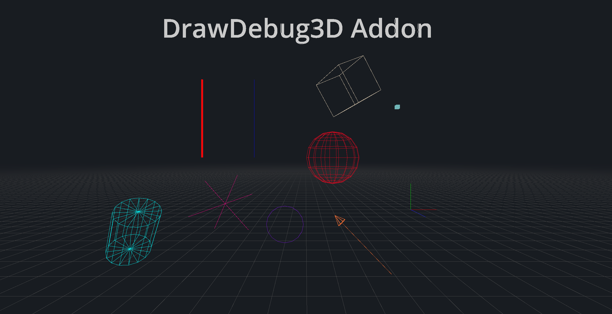

# DrawDebug3D

A lightweight Godot plugin for rendering 3D debug primitives during development.

## ✨ Features

- Line
- Lines
- Box Line
- Dot
- Box
- Capsule
- Cylinder
- Circle
- Sphere
- Arrow
- Cross
- Grid
- Collider
- Gizmo
- 3D Text

## 📦 Installation

- **1.** Clone this repository or download the folder.
- **2.** Place the uncompressed folder inside your project's `addons/` directory.
- **3.** Enable the plugin via `Project > Project Settings > Plugins`.
